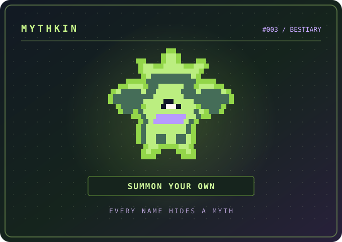

<!--
  DRANE / GitHub Profile
  Creative-portfolio edition • github.com/Drane22
  Public-facing content contains no private repository names.
  To set up the animated contribution snake, see SETUP.md.
-->

  

  <h3>Making useful things feel a little more extraordinary.</h3>
  

    Hey, I'm <b>Lenard</b> — I build creative digital experiences, practical web tools, 
    and the occasional hardware experiment.
  

  

    
    
    
    
  

  

    
    
    
    
  

  

---

### 01 / The work

Three projects that say a lot about how I like to build: start with an unusual idea, then turn it into something people can actually use.

<table>
  <tr>
    <td width="62%" valign="top">
      FEATURED PROJECT / 001 · MUSIC × VISUAL SEARCH
      <h2><a href="https://github.com/Drane22/Articol">ARTICOL ↗</a></h2>
      
<b>Find records by the way they look.</b>

      
A different kind of music discovery tool. Articol looks at album artwork through color palettes, composition, typography, and visual embeddings — so visual resemblance can lead the search, instead of genre alone.

      
<code>Next.js</code> <code>TypeScript</code> <code>CLIP</code> <code>Supabase</code>

      
<a href="https://articol-lime.vercel.app"><b>LIVE EXPERIENCE ↗</b></a> &nbsp;·&nbsp; <a href="https://github.com/Drane22/Articol">SOURCE CODE ↗</a>

    </td>
    <td width="38%" align="center" valign="middle">
      
      
Music is visual, too.

    </td>
  </tr>
</table>

 

<table>
  <tr>
    <td width="38%" align="center" valign="middle">
      
      
One link. Many little worlds.

    </td>
    <td width="62%" valign="top">
      FEATURED PROJECT / 002 · GENERATIVE DESIGN × WEBGPU
      <h2><a href="https://github.com/Drane22/UrbanScan">URBANSCAN ↗</a></h2>
      
<b>What if a QR code could become a world?</b>

      
UrbanScan transforms URLs into procedural visual worlds — cities, circuitry, reefs, terrain, and more — then reveals the scannable QR beneath the art. A playful blend of generative visuals, interaction design, and functional code.

      
<code>TypeScript</code> <code>WebGPU</code> <code>QR</code> <code>Procedural 3D</code>

      
<a href="https://urbanscan-omega.vercel.app/"><b>OPEN THE STUDIO ↗</b></a> &nbsp;·&nbsp; <a href="https://github.com/Drane22/UrbanScan">SOURCE CODE ↗</a>

    </td>
  </tr>
</table>

 

<table>
  <tr>
    <td width="62%" valign="top">
      FEATURED PROJECT / 003 · MYTHOLOGY × PROCEDURAL CREATURES
      <h2><a href="https://github.com/Drane22/Mythkin">MYTHKIN ↗</a></h2>
      
<b>What monster hides in your name?</b>

      
Type a name and summon a one-of-a-kind pixel-voxel creature inspired by 14 mythological traditions. Each name generates a repeatable identity, anatomy, and rarity — brought to life with animated 3D details and shareable bestiary cards, all in your browser.

      
<code>React</code> <code>TypeScript</code> <code>Three.js</code> <code>Procedural Generation</code>

      
<a href="https://mythkin-eta.vercel.app/"><b>SUMMON A MYTHKIN ↗</b></a> &nbsp;·&nbsp; <a href="https://github.com/Drane22/Mythkin">SOURCE CODE ↗</a>

    </td>
    <td width="38%" align="center" valign="middle">
      
      
One name. One myth. Your monster.

    </td>
  </tr>
</table>

  
<b>More from the workbench ↓</b>

   
  <table>
    <tr><td><b><a href="https://github.com/Drane22/Patient-Registration-Web-App">PaReS / Patient Registry</a></b></td><td>Patient registration, duplicate review, facility check-ins, and role-based access in a full-stack workflow. A development project, not a claim of legal or regulatory certification.</td></tr>
    <tr><td><b><a href="https://github.com/Drane22/EPD-nRF5">EPD-nRF5 / Paper Companion</a></b></td><td>An English-first fork exploring a Web Bluetooth companion for Nordic e-paper displays, Spotify information, and static display layouts.</td></tr>
    <tr><td><b><a href="https://github.com/Drane22/pocketkin">Pocketkin</a></b></td><td>A playful interactive-creature experiment. <a href="https://pocketkin.vercel.app">Visit ↗</a></td></tr>
    <tr><td><b><a href="https://github.com/Drane22/tbh-bot">TBH Companion</a></b></td><td>A TaskBarHero companion fork with Discord presence and automation experiments.</td></tr>
  </table>

---

### 02 / Currently exploring

| THE IDEA | WHERE I'M TAKING IT |
| :--- | :--- |
| **Visual discovery** | Finding more human ways to navigate art, music, and media. |
| **Procedural experiences** | Turning ordinary inputs — like URLs and names — into playful worlds and mythological creatures. |
| **Thoughtful health tools** | Making complex data and patient workflows easier to handle responsibly. |
| **Small hardware, big personality** | E-paper, Bluetooth, and interfaces that don't need a full-size screen. |

> **My approach:** Make it work. Make it intuitive. Then give it a personality.

---

### 03 / The toolkit

  
<b>Languages &amp; frameworks</b>

  
  
<b>Data &amp; deployment</b>

  
  
Also playing with visual embeddings, WebGPU, Web Bluetooth, and Nordic e-paper.

---

### 04 / Code in motion

  
<b>GitHub overview</b>

  <!-- Exact GitHub Stats Extended URLs provided by Drane22. -->
  <!-- Private stats are controlled by the provider's GitHub Private Access authorization and cache. -->
  
  
   
  
<b>Contribution streak</b>

  

<b>The contribution garden, with a resident snake.</b>

<!-- The snake image appears after .github/workflows/snake.yml completes its first run. -->

  <picture>
    <source media="(prefers-color-scheme: dark)" srcset="https://raw.githubusercontent.com/Drane22/Drane22/output/github-snake-dark.svg" />
    <source media="(prefers-color-scheme: light)" srcset="https://raw.githubusercontent.com/Drane22/Drane22/output/github-snake-light.svg" />
    
  </picture>

---

  <h3>Have an interesting idea?</h3>
  
I'm usually somewhere between a sketch, a browser tab, and a working prototype.

  
  
Made with curiosity. Built in public, where possible.

